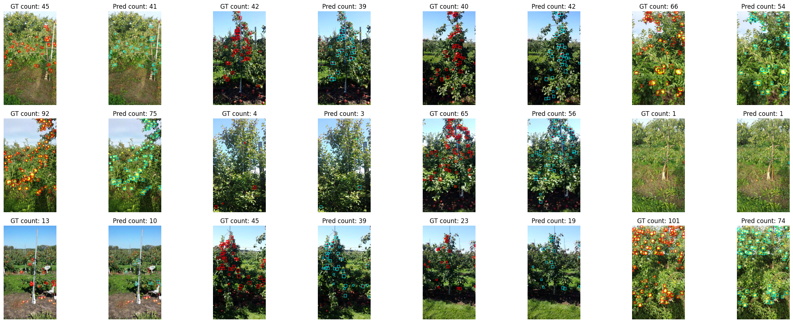

# Detectron2 MinneApple Detection using RetinaNet

## 🍎🍏 MinneApple Dataset 

[](https://www.python.org)
[](https://pytorch.org)


This repository contains a object detection project focused on **counting on apples** with **binary detection** using **RetinaNet**.

---

## 🧭 Dataset Overview

The dataset includes the following apples annotations for object detection, originally instance annotations:

Train images: 536
Train annotations: 22595
Categories: [{'id': 1, 'name': 'apple'}]

Valid images: 134
Valid annotations: 5582
Categories: [{'id': 1, 'name': 'apple'}]

---

## 🏗️ Model Architecture

- 🔷 Model: **RetinaNet**
- 🔷 Weight: **"R_101"**
- 🔷 Framework: **PyTorch + Detectron2**
- 🔷 Input Size: **1280**
- 🔷 Trained Epochs: **40**

---

## 📊 Final Performance
```
Average Precision  (AP) @[ IoU=0.50:0.95 | area=   all | maxDets=100 ] = 0.334
 Average Precision  (AP) @[ IoU=0.50      | area=   all | maxDets=100 ] = 0.704
 Average Precision  (AP) @[ IoU=0.75      | area=   all | maxDets=100 ] = 0.265
 Average Precision  (AP) @[ IoU=0.50:0.95 | area= small | maxDets=100 ] = 0.351
 Average Precision  (AP) @[ IoU=0.50:0.95 | area=medium | maxDets=100 ] = 0.505
 Average Precision  (AP) @[ IoU=0.50:0.95 | area= large | maxDets=100 ] = -1.000
 Average Recall     (AR) @[ IoU=0.50:0.95 | area=   all | maxDets=  1 ] = 0.017
 Average Recall     (AR) @[ IoU=0.50:0.95 | area=   all | maxDets= 10 ] = 0.129
 Average Recall     (AR) @[ IoU=0.50:0.95 | area=   all | maxDets=100 ] = 0.413
 Average Recall     (AR) @[ IoU=0.50:0.95 | area= small | maxDets=100 ] = 0.395
 Average Recall     (AR) @[ IoU=0.50:0.95 | area=medium | maxDets=100 ] = 0.598
 Average Recall     (AR) @[ IoU=0.50:0.95 | area= large | maxDets=100 ] = -1.000
[07/08 18:07:37 d2.evaluation.coco_evaluation]: Evaluation results for bbox: 
|   AP   |  AP50  |  AP75  |  APs   |  APm   |  APl  |
|:------:|:------:|:------:|:------:|:------:|:-----:|
| 33.440 | 70.428 | 26.476 | 35.142 | 50.519 |  nan  |
```

### 📈 Optimal Evaluation Metrics:
```
|   AP   |  AP50  |  AP75  |  APs   |  APm   |  APl  |
|:------:|:------:|:------:|:------:|:------:|:-----:|
| 32.015 | 67.124 | 25.976 | 32.680 | 50.179 |  nan  |

📊 Precision: 0.8277
📊 Recall:    0.7048
📊 F1 Score:  0.7613
```

---

## 🎨 Visualization Samples

The model outputs of **validation set** are visualized:

📌 Example of val:
  

---

## 🚀 How to Run Inference
```python
run_gt_vs_result_comparison(40) 
```

---

## 🔑 Summary

✅ Applied mostly default configs  
✅ Implemented minimally  
✅ **Note** Not bad results.

---

## 📄 License

This project is intended for **academic research and educational use** only. Please cite **original dataset paper** or **appropriately to this repo** if used in publications.

---

## ⭐ Acknowledgements

- RetinaNet powered by `Detectron2`
- Based on Popular instance segmentation benchmarking dataset `MinneApple`

---
